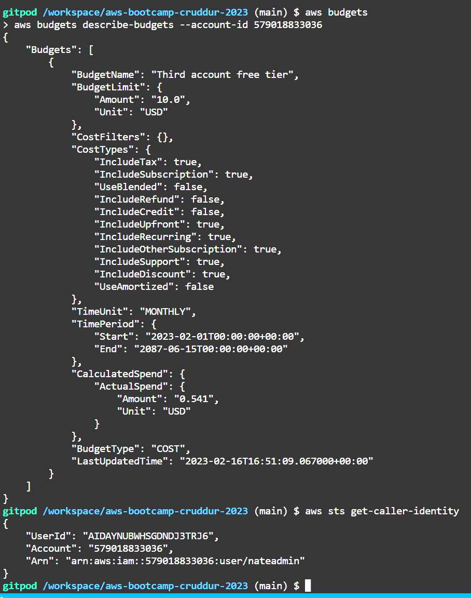
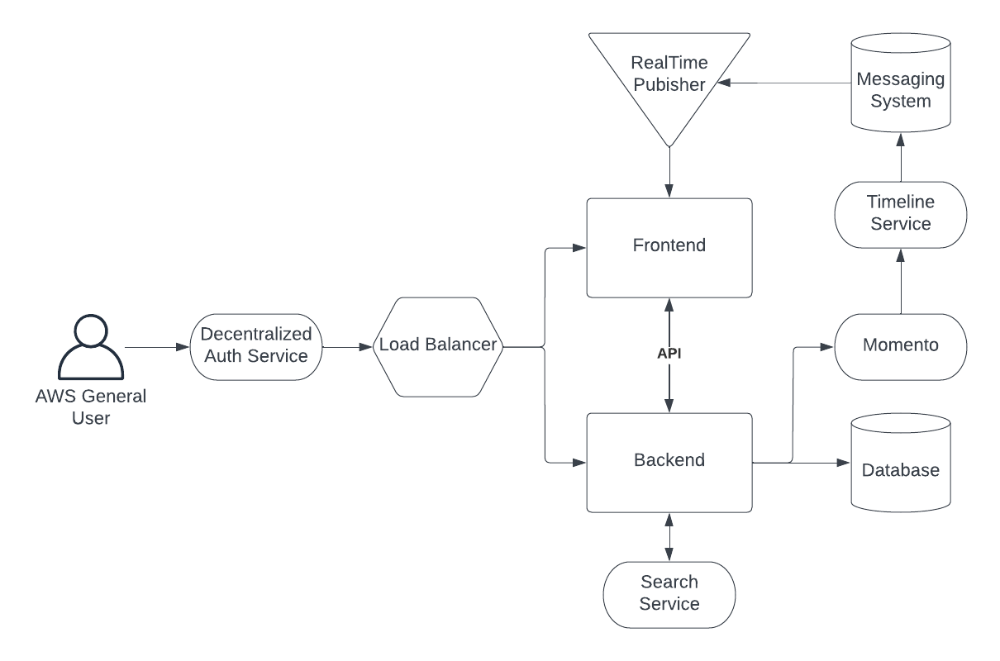
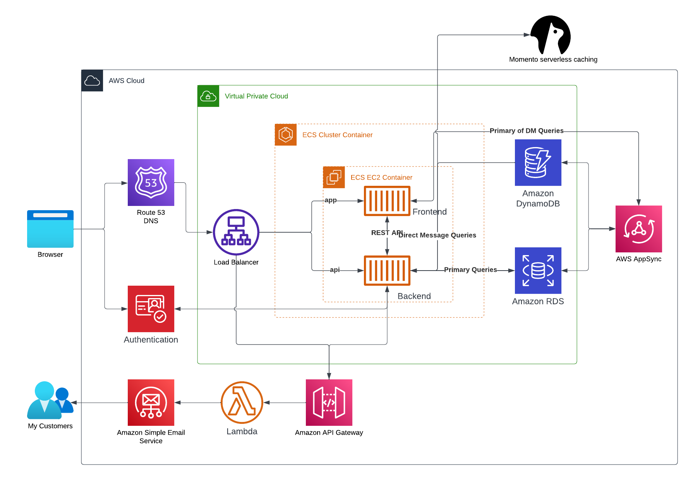

# Week 0 — Billing and Architecture


## Homework

### Account / user creation
- Created new account and user from a previous AWS account since I had used my free-tier credits on my old account

```
gitpod /workspace/aws-bootcamp-cruddur-2023 (main) $ aws sts get-caller-identity
{
    "UserId": "AIDA*********TRJ6",
    "Account": "579018833036",
    "Arn": "arn:aws:iam::579018833036:user/******"
}
```


### Credentials

- created programmatic access and secret key and stored them in gitpod env variables


- created user and doublechecked in cli == 


### Billing

- created billing alarm at 8$


- cli description of alarm


### Budget

- crated budget for 10$


- cli description of budget



### Napkin

[Napkin view-only chart link](https://lucid.app/lucidchart/98335371-5707-4a45-bbf5-2f1b167258f6/edit?viewport_loc=-162%2C-108%2C3072%2C1597%2C0_0&invitationId=inv_83784cd2-6a9e-4801-93f1-64a342ce2211)




### Logical architecture design

[Logical design view-only chart link](https://lucid.app/lucidchart/a7f0bde4-883e-4ea4-9a58-76ed6444a9e7/edit?viewport_loc=-661%2C-310%2C3072%2C1521%2C0_0&invitationId=inv_bcdb7284-63fb-4b9a-b5b2-64a0d0c0451b)



### Homework Challenges

- add SES email integration for batch sending updates/promotions/news

## Issues

- Never used Gitpod before, it was buggy starting new workspaces.
- No other issues since I had been using VScode desktop recently with github.
